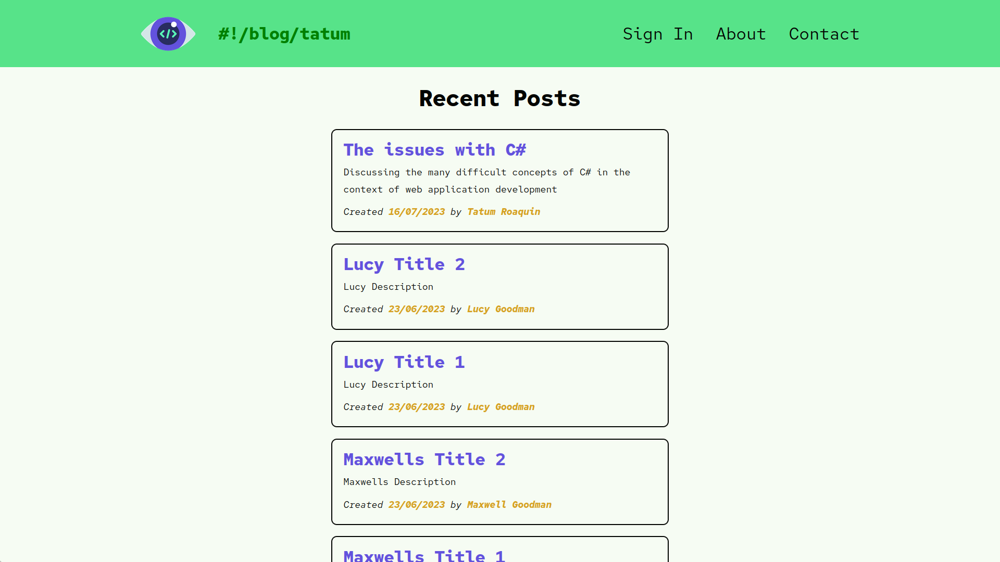

<h1 align="center">#!/blog/tatum</h1>

<h5 align="center">04/06/2023 - Present</h5>

<h2 align="center">Description</h2>

<code>#!/blog/tatum</code> is a blogging platform build using the MERN stack

  
  
  
  
  

